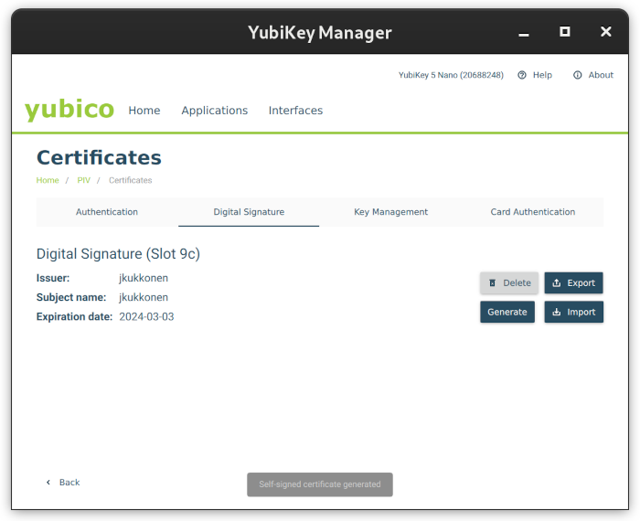

# CI-based TUF implementation

This is a TUF implementation that operates on Continuous Integration platform.
Supported features include:
* Threshold signing with offline keys, guided by CI
* Automated online signing
* Streamlined, opinionated user experience
* No custom code required

The optimal use case (at least to begin with) is TUF repositories with a low
to moderate frequency of change, both for target target files and keys.

This is a Work-In-Progress: any code should be seen as experimental for now. See [example](https://github.com/jku/test-repo-for-playground/) for an instance running repository-playground.

## Documentation

* [Design document](https://docs.google.com/document/d/140jiFHGc3wwEmNaJmUdgkNeNK4i4CC-lm5-eVQYXiL0)
* [Implementation notes](IMPLEMENTATION-NOTES.md)

## Setup

Current signing requirements are:
 * A HW key with PIV support (such as a newer Yubikey)

### Setup signer

1. Create a PIV signing key on your HW key if you don't have one. For Yubikey owners the easiest tool is Yubikey manager:
   
   [yubico-piv-tool](https://developers.yubico.com/yubico-piv-tool/) can also do it (just copy-paste the public key and certificate when requested):
   ```
   yubico-piv-tool -a generate -a verify-pin -a selfsign -a import-certificate -s 9c -k -A ECCP256 -S '/CN=piv_auth/OU=example/O=example.com/'
   ```
1. Install a PKCS#11 module. Playground has been tested with the Yubico implementation,
   Debian users can install it with
   ```
   apt install ykcs11
   ```
1. install playground-sign
   ```
   pip install git+https://git@github.com/jku/repository-playground#subdirectory=playground/signer
   ```

### Configure signer

Whenever you run signing tools, you need a configuration file `.playground-sign.ini` in the root dir of the git repository that contains the metadata:
   ```
   [settings]
   # Path to PKCS#11 module
   pykcs11lib = /usr/lib/x86_64-linux-gnu/libykcs11.so
   # GitHub username
   user-name = @my-github-username
   ```

### Setup a new Playground repository

1. Fork the [template](https://github.com/jku/playground-template).
1. To enable repository publishing, set _Settings->Pages->Source to `Github Actions`. `main`
   should be enabled as deployment branch in _Settings->Environments->GitHub Pages_.

#### Using a KMS

If you intend to use Google Cloud KMS for online signing (instead of the default
"ambient Sigstore signing"), there are a couple of extra steps:
1. Make sure Google Cloud allows this repository OIDC identity to sign with a KMS key.
1. Define your GCP authentication details as repository variables in
   _Settings->Secrets and variables->Actions->Variables_. Examples:
   ```
   GCP_WORKLOAD_IDENTITY_PROVIDER: projects/843741030650/locations/global/workloadIdentityPools/git-repo-demo/providers/git-repo-demo
   GCP_SERVICE_ACCOUNT: git-repo-demo@python-tuf-kms.iam.gserviceaccount.com
   ```
1. _(only needed for initial repository creation)_ Install
   [gcloud](https://cloud.google.com/sdk/docs/install) and authenticate in the
   environment where you plan to run playground-delegate tool (you will need
   _roles/cloudkms.publicKeyViewer_ permission)

## Operation

### Initial signing event

1. Run delegate tool to create initial metadata
   ```
   playground-delegate
   ```
1. Commit all changes in `metadata/`, push to a branch `sign/<signing-event-name>`

This starts a signing event.

### Modify target files

1. Add, remove or modify files under targets/ directory
1. Run signer tool
   ```
   playground-sign
   ```
1. Commit changes (both target files and metadata) and push to a branch `sign/<signing-event-name>`

This starts a signing event.

### Add a delegation or modify an existing one

1. Run delegate tool when you want to modify a roles delegation
   ```
   playground-delegate <role>
   ```
1. Commit all changes in `metadata/`, push to a branch `sign/<signing-event-name>`

This starts a signing event.

### Sign changes made by others

Signing should be done when the signing event (GitHub issue) asks for it:

1. Run signer tool in the signing event branch
   ```
   playground-sign
   ```
2. Commit metadata changes and push to a branch `sign/<signing-event-name>`

This updates the signing event.

## Components

### Repository template

Status: Implemented in the playground-template project. Workflows include
* signing-event
* snapshot
* version-bumps

See [https://github.com/jku/playground-template]

### Repository actions

Status:
* *actions/signing-event*: functionality is there but output is a work in progress, and
  various checks are still unimplemented 
* *actions/snapshot*: Implemented
* *actions/online-version-bump*: Implemented
* *actions/offline-version-bump*: Implemented

Various parts are still very experimental
* loads of content safety checks are missing
* output of the signing event is a work in progress
* failures in the actions are not visible to user
* testing is still completely manual
* Several actions are hacks more than mature implementations 

See [repo/](repo/), See [actions/](actions/)

### signing tool

Status:
* playground-delegate mostly implented
* playground-sign mostly implemented, althought output is a work in progress
* Neither tool integrates git push/pull yet: at least for playground-sign integration would make a lot of sense

See [signer/](signer/)

### Client

`client/` contains a simple downloader client. It can securely lookup and download artifacts from the repository.
There is nothing specific to this repository implementation in the client implementation: any other client could be used. 

TODO: Client is currently not up-to-date WRT repository implementation.
